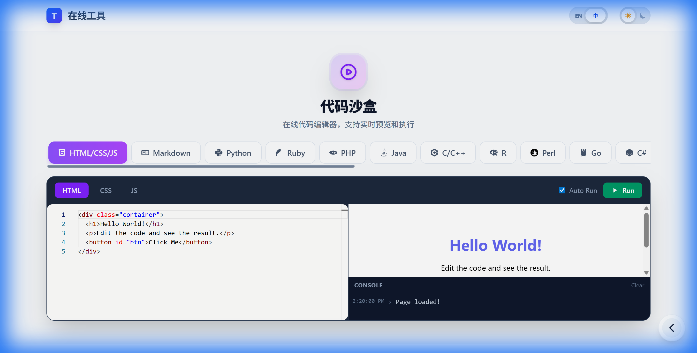
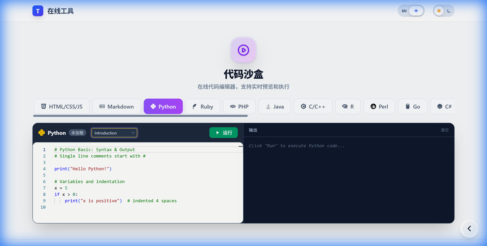
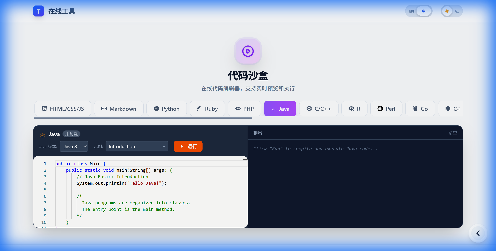
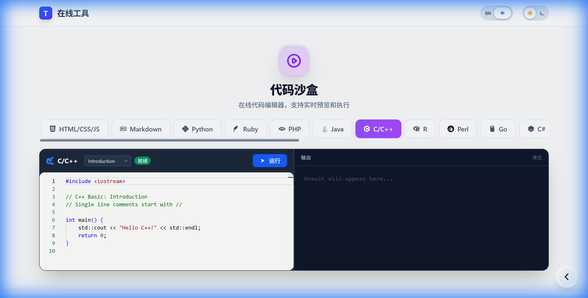
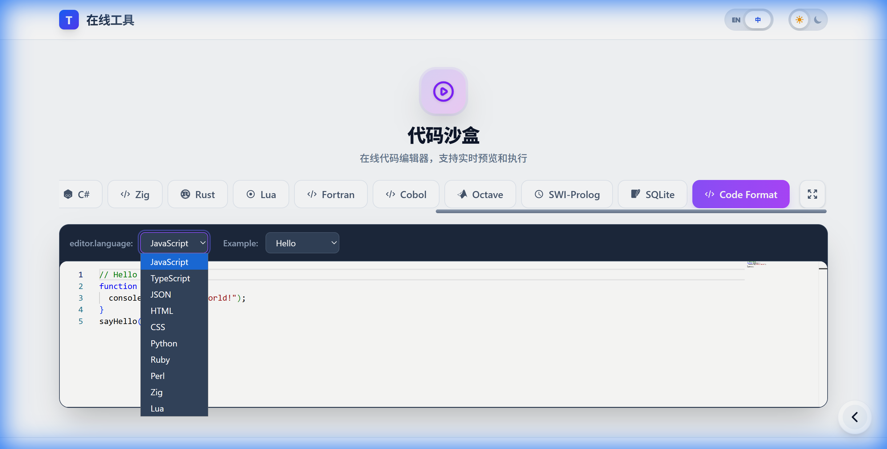
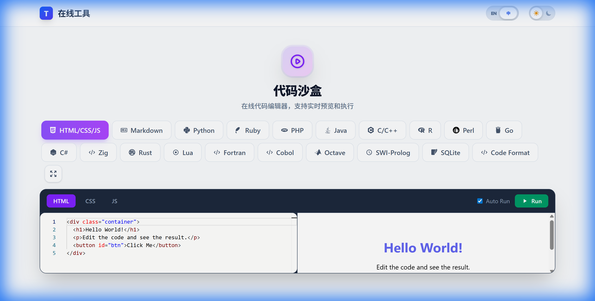
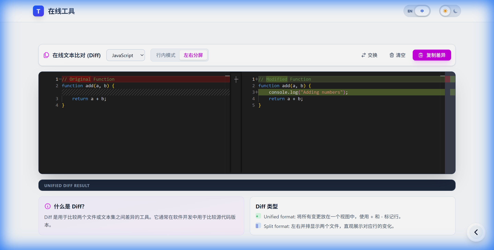
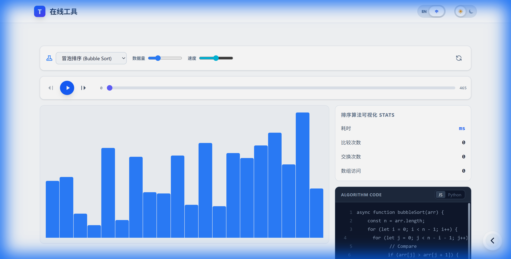
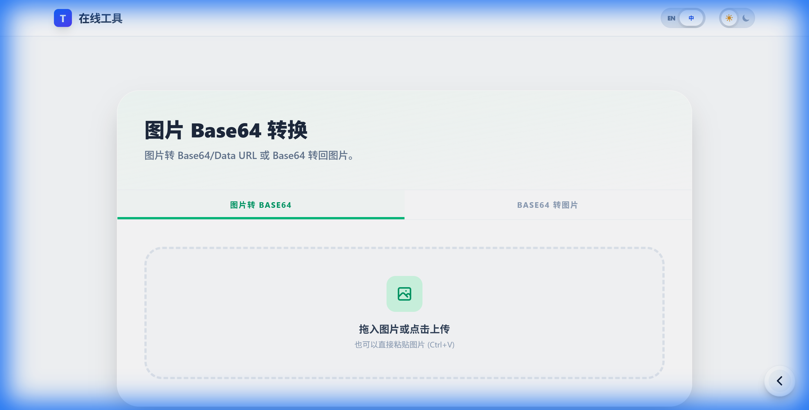

# 🛠️ 在线工具集

[](LICENSE)
[](https://github.com/liudonghua123/tools/actions)
[](https://vuejs.org/)
[](https://tailwindcss.com/)

一个专业、高性能且设计精美的在线工具箱。专注于用户体验 (UX)、速度和开发者友好的架构。

[English Version (README.md)](README.md)

## 📸 预览


## 🌟 核心功能

| 工具名称 | 描述 | 关键特性 |
| :--- | :--- | :--- |
| **[代码沙盒](https://liudonghua123.github.io/tools/#/code-playground)** | 多语言在线开发环境 | **19+ 种语言**, 100% 客户端运行, WASM 运行时 |
| **[文本比对](https://liudonghua123.github.io/tools/#/diff-viewer)** | 专业的文本差异对比工具 | 左右/行内视图, 语法高亮 |
| **[排序可视化](https://liudonghua123.github.io/tools/#/sorting-visualizer)** | 交互式排序算法演示 | 动态动画, 分步执行, 统计性能 |
| **[图片 Base64](https://liudonghua123.github.io/tools/#/base64-image)** | 图片与 Base64 编码互转 | 本地处理, 支持拖拽 |
| **[字符编码](https://liudonghua123.github.io/tools/#/char-encoding)** | 全面的文本编码转换工具 | 多编码支持, 十六进制/二进制视图 |
| **[身份证助手](https://liudonghua123.github.io/tools/#/id-card)** | 身份证验证与信息提取 | 校验和验证, 区域/年龄/性别自动提取 |
| **[端口查询](https://liudonghua123.github.io/tools/#/port-query)** | 网络端口信息查询服务 | 基于维基百科数据, 支持搜索 |
| **[域名 WHOIS](https://liudonghua123.github.io/tools/#/whois-domain)** | 基于 RDAP 的域名记录查询 | 实时查阅, 详细所有权信息 |
| **[IP WHOIS](https://liudonghua123.github.io/tools/#/whois-ip)** | 基于 RDAP 的 IP 地址查询 | 地理位置定位, ISP 供应商信息 |

---

## 🚀 特色功能: 代码沙盒 (Code Playground)

**代码沙盒** 是本项目的核心工具，在浏览器中提供功能完备的 IDE 体验。

### ⚡ 纯前端离线支持
不同于依赖后端服务器的传统在线编译器，我们的沙盒通过 WebAssembly (WASM) 技术 **完全在客户端** 执行代码。
- **极速响应**: 接近原生的运行速度，无服务器延迟。
- **隐私保护**: 代码从未离开您的浏览器。
- **离线使用**: 初始加载后，无需互联网连接即可编写和运行代码。

### 📸 界面预览

| 语言选择菜单 | Python 支持 |
| :---: | :---: |
|  |  |

| Java 支持 | C++ 支持 |
| :---: | :---: |
|  |  |

| 多语言编辑器 | 完整编程语言支持矩阵 |
| :---: | :---: |
|  |  |

### 📚 支持语言与运行时技术
我们支持众多的编程语言，每种语言都运行在专门的浏览器端引擎上。

| 类别 | 语言 | 运行时技术 |
| :--- | :--- | :--- |
| **Web 基础** | HTML5, CSS3, JavaScript, Markdown | 浏览器原生引擎 |
| **脚本语言** | Python 3.11, Ruby 3.2, PHP 8.2 | Pyodide, Ruby.wasm, Php-wasm |
| **系统编程** | C/C++, Rust, Go, Zig | LLVM/Clang WASM, Go WASM |
| **企业级应用** | Java (8/11/17), C# (.NET) | CheerpJ JVM, Dotnet-WASM |
| **科学计算** | Octave, R, Fortran | Octave-WASM, WebR |
| **其他** | Perl, Lua, Cobol, SWI-Prolog, SQLite | WebPerl, Lua-WASM, sql.js |

### 📋 完整语言列表 (19+ 模式)
该沙盒目前支持 **19 种独立运行模式**:
`HTML/CSS/JS Sandbox`, `Markdown Preview`, `Python 3`, `Ruby`, `PHP`, `Java (8/11/17)`, `C/C++ (Clang)`, `R`, `Perl`, `Go`, `C#`, `Zig`, `Rust`, `Lua`, `Fortran`, `Cobol`, `Octave`, `SWI-Prolog`, `SQLite`。

此外，**单文件编辑器 (Single-file Editor)** 支持以下语言的语法高亮和代码片段: `JavaScript`, `TypeScript`, `JSON`, `HTML`, `CSS`, `Python`, `Ruby`, `Perl`, `Zig`, 和 `Lua`。

---

## 🛠️ 工具亮点展示

### 文本比对 & 排序可视化
为开发者和学生设计的专业工具。

| 文本比对 | 排序可视化 |
| :---: | :---: |
|  |  |

### 实用工具
高效、安全且直观的日常任务助手。

| 图片 Base64 | 字符编码 | 身份证助手 |
| :---: | :---: | :---: |
|  |  |  |

---

## 🏗️ 架构与项目结构

本项目使用 Vue 3 和 Vite 构建，具备自动化的工具发现与注册机制。

### 目录结构

```text
tools/
├── public/              # 静态资源
├── scripts/             # 构建脚本 (如自动数据抓取)
├── src/
│   ├── components/      # 共享 UI 组件
│   ├── layouts/         # 主布局模板
│   ├── locales/         # 全局 i18n 语言包
│   ├── router/          # 动态路由逻辑
│   ├── views/
│   │   ├── HomeView.vue # 工具仪表盘
│   │   └── tools/       # 🚀 个性化工具模块 (独立封装)
│   │       └── [tool-id]/
│   │           ├── index.vue     # 工具实现
│   │           ├── config.js     # 工具元数据 (分类、图标、颜色)
│   │           └── locales/      # 工具专用 i18n
│   └── main.js          # 应用入口
└── tailwind.config.js   # 设计系统配置
```

## 🛠️ 技术栈

- **前端**: Vue 3 (Composition API), Vite (极速热更新).
- **样式**: Tailwind CSS (Utility-first, 响应式, 暗黑模式).
- **状态管理**: 响应式 API (`ref`, `reactive`).
- **路由**: 基于目录结构的动态自动生成。
- **国际化**: `vue-i18n` (支持逐工具的语言定义)。
- **部署**: GitHub Actions 自动部署至 GitHub Pages。

## 🛠️ 开发指南

得益于模块化设计，添加新工具非常简单：

1. **创建目录**: `src/views/tools/my-new-tool/`
2. **编写逻辑**: 创建 `index.vue`。
3. **配置元数据**: 创建 `config.js`。
4. **本地化**: 在子目录 `locales/` 中添加翻译文件。

系统将自动识别并注册新工具。

## 🛠️ 本地开发

```bash
# 克隆仓库
git clone https://github.com/liudonghua123/tools.git && cd tools

# 安装并运行
npm install
npm run dev
```

## 📄 开源协议

基于 MIT License 开源。

Developed with ❤️ by [liudonghua123](https://github.com/liudonghua123)
