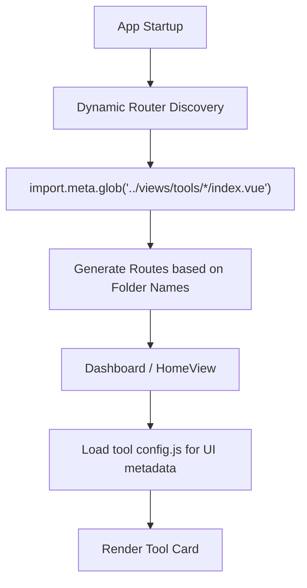

# 🛠️ Online Tools

[](LICENSE)
[](https://github.com/liudonghua123/tools/actions)
[](https://vuejs.org/)
[](https://tailwindcss.com/)

A professional, high-performance, and beautifully designed online toolbox. Built with a focus on user experience (UX), speed, and developer-friendly architecture.

## 🌟 Key Features

- **🌐 Network Tools**: Whois Domain (RDAP), Whois IP (RDAP), Port Query (fetched from Wikipedia).
- **🆔 Identity & Utility**: ID Card tools, Regex Tester, Diff Tool, Code Playground.
- **🎨 Modern Design**: Responsive, Glassmorphism UI, Dark Mode.
- **🌍 Global Ready**: Full i18n (EN/ZH) support.

## 🏗️ Architecture & Project Structure

The project is built as a Single Page Application (SPA) using Vue 3 and Vite, with automated tool discovery and registration.

### Directory Layout

```text
tools/
├── public/              # Static assets
├── scripts/             # Build scripts (e.g., automated data fetching)
├── src/
│   ├── components/      # Shared UI components (FABs, Switches, Layouts)
│   ├── layouts/         # Main layout wrapper
│   ├── locales/         # Global i18n messages
│   ├── router/          # Dynamic routing logic
│   ├── views/
│   │   ├── HomeView.vue # Tool dashboard
│   │   └── tools/       # 🚀 Individual tool modules (Self-contained)
│   │       └── [tool-id]/
│   │           ├── index.vue     # Tool implementation
│   │           ├── config.js     # Tool metadata (cat, icon, color)
│   │           └── locales/      # Tool-specific i18n
│   └── main.js          # App entry point
└── tailwind.config.js   # Design system configuration
```

### Flow Diagram



## 🛠️ Technical Specification

- **Frontend**: Vue 3 (Composition API), Vite (Fast HMR).
- **Styling**: Tailwind CSS (Utility-first, responsive, dark mode).
- **State Management**: Vue's built-in `ref` and `reactive` (Lightweight).
- **Dynamic Routing**: Automatic route generation from directory structure in `src/router/index.js`.
- **Localization**: `vue-i18n` with scoped locales per tool.
- **Build & CI**: GitHub Actions for automated deployment to GitHub Pages.

## 📝 Tool Development Guide

Adding a new tool is easy thanks to the modular design:

1. **Create Directory**: `src/views/tools/my-new-tool/`
2. **Implement Logic**: Create `index.vue`. Use `BackButton` and standard layout.
3. **Configure Metadata**: Create `config.js`:
   ```javascript
   export default {
       id: 'my-new-tool',
       cat: 'utility', // 'network', 'identity', etc.
       icon: 'sparkles',
       color: 'from-blue-500 to-indigo-600'
   }
   ```
4. **Localization**: Add `locales/en.json` and `zh.json` inside the tool folder.

The router and dashboard will automatically detect and register your tool.

## 🛠️ Development Setup

```bash
# Clone
git clone https://github.com/liudonghua123/tools.git && cd tools

# Install & Run
npm install
npm run dev
```

## 📄 License & Support

Distributed under the MIT License.

<a href="https://www.buymeacoffee.com/liudonghuan"></a>

Developed with ❤️ by [liudonghua123](https://github.com/liudonghua123)
