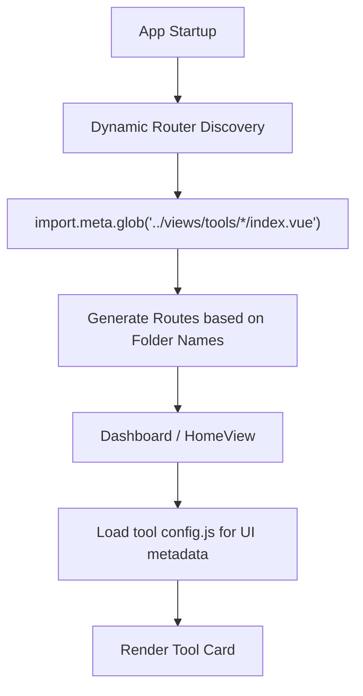

# 🛠️ Online Tools

[](LICENSE)
[](https://github.com/liudonghua123/tools/actions)
[](https://vuejs.org/)
[](https://tailwindcss.com/)

A professional, high-performance, and beautifully designed online toolbox. Built with a focus on user experience (UX), speed, and developer-friendly architecture.

[中文版 (README-ZH_CN.md)](README-ZH_CN.md)

## 📸 Preview


## 🌟 Key Features

| Tool Name | Description | Key Features |
| :--- | :--- | :--- |
| **[Code Playground](https://liudonghua123.github.io/tools/#/code-playground)** | Multi-language online development environment | **19+ Languages**, 100% Client-side, WASM Runtimes |
| **[Diff Viewer](https://liudonghua123.github.io/tools/#/diff-viewer)** | Professional text comparison tool | Side-by-side/Inline views, Syntax highlighting |
| **[Sorting Visualizer](https://liudonghua123.github.io/tools/#/sorting-visualizer)** | Interactive algorithm visualization | Animations, Step-by-step execution, Stats |
| **[Base64 Image](https://liudonghua123.github.io/tools/#/base64-image)** | Image to Base64 & vice versa | Local processing, Drag-and-drop support |
| **[Char Encoding](https://liudonghua123.github.io/tools/#/char-encoding)** | Comprehensive text encoding converter | Multi-encoding, Hex/Binary views |
| **[ID Card Tool](https://liudonghua123.github.io/tools/#/id-card)** | Identity verification and info utility | Checksum validation, Info extraction |
| **[Port Query](https://liudonghua123.github.io/tools/#/port-query)** | Network port information service | Wikipedia-backed data, Searchable |
| **[Whois Domain](https://liudonghua123.github.io/tools/#/whois-domain)** | RDAP-based domain records query | Real-time lookup, Detailed info |
| **[Whois IP](https://liudonghua123.github.io/tools/#/whois-ip)** | RDAP-based IP address query | Geolocation, ISP info |

---

## 🚀 Featured: Code Playground

The **Code Playground** is our flagship tool, providing a full-featured IDE experience directly in your browser. 

### ⚡ Pure Frontend Offline Support
Unlike traditional online compilers that rely on backend servers, our playground executes code **entirely on the client side** using WebAssembly (WASM). 
- **Zero Latency**: Code runs at near-native speeds.
- **Privacy First**: Your code never leaves your browser.
- **Offline Capable**: Once loaded, you can code without an internet connection.

### 📸 Interface Preview

| Languages Menu | Python Support |
| :---: | :---: |
|  |  |

| Java Support | C++ Support |
| :---: | :---: |
|  |  |

| Multi-language Editor | Complete Language Support Matrix |
| :---: | :---: |
|  |  |

### 📚 Supported Languages & Runtimes
We support a wide array of programming languages, each running on specialized browser-based engines.

| Category | Languages | Runtime Technology |
| :--- | :--- | :--- |
| **Web & Base** | HTML5, CSS3, JavaScript, Markdown | Native Browser Engine |
| **Scripting** | Python 3.11, Ruby 3.2, PHP 8.2 | Pyodide, Ruby.wasm, Php-wasm |
| **Systems** | C/C++, Rust, Go, Zig | LLVM/Clang WASM, Go WASM |
| **Enterprise** | Java (8/11/17), C# (.NET) | CheerpJ JVM, Dotnet-WASM |
| **Scientific** | Octave, R, Fortran | Octave-WASM, WebR |
| **Others** | Perl, Lua, Cobol, SWI-Prolog, SQLite | WebPerl, Lua-WASM, sql.js |

### 📋 Full Language List (19+ Modes)
The sandbox currently supports **19 distinct execution modes**:
`HTML/CSS/JS Sandbox`, `Markdown Preview`, `Python 3`, `Ruby`, `PHP`, `Java (8/11/17)`, `C/C++ (Clang)`, `R`, `Perl`, `Go`, `C#`, `Zig`, `Rust`, `Lua`, `Fortran`, `Cobol`, `Octave`, `SWI-Prolog`, `SQLite`.

Additionally, the **Single-file Editor** supports syntax highlighting and code snippets for: `JavaScript`, `TypeScript`, `JSON`, `HTML`, `CSS`, `Python`, `Ruby`, `Perl`, `Zig`, and `Lua`.

---

## 🛠️ Individual Tool Highlights

### Diff Viewer & Sorting Visualizer
Professional-grade tools for developers and students.

| Diff Viewer | Sorting Visualizer |
| :---: | :---: |
|  |  |

### Utility Tools
Fast, secure, and intuitive utilities for everyday tasks.

| Base64 Image | Char Encoding | ID Card Tool |
| :---: | :---: | :---: |
|  |  |  |

---

## 🏗️ Architecture & Project Structure

The project is built as a Single Page Application (SPA) using Vue 3 and Vite, with automated tool discovery and registration.

### Directory Layout

```text
tools/
├── public/              # Static assets
├── scripts/             # Build scripts (e.g., automated data fetching)
├── src/
│   ├── components/      # Shared UI components (FABs, Switches, Layouts)
│   ├── layouts/         # Main layout wrapper
│   ├── locales/         # Global i18n messages
│   ├── router/          # Dynamic routing logic
│   ├── views/
│   │   ├── HomeView.vue # Tool dashboard
│   │   └── tools/       # 🚀 Individual tool modules (Self-contained)
│   │       └── [tool-id]/
│   │           ├── index.vue     # Tool implementation
│   │           ├── config.js     # Tool metadata (cat, icon, color)
│   │           └── locales/      # Tool-specific i18n
│   └── main.js          # App entry point
└── tailwind.config.js   # Design system configuration
```

### Flow Diagram



## 🛠️ Technical Specification

- **Frontend**: Vue 3 (Composition API), Vite (Fast HMR).
- **Styling**: Tailwind CSS (Utility-first, responsive, dark mode).
- **State Management**: Vue's built-in `ref` and `reactive` (Lightweight).
- **Dynamic Routing**: Automatic route generation from directory structure in `src/router/index.js`.
- **Localization**: `vue-i18n` with scoped locales per tool.
- **Build & CI**: GitHub Actions for automated deployment to GitHub Pages.

## 📝 Tool Development Guide

Adding a new tool is easy thanks to the modular design:

1. **Create Directory**: `src/views/tools/my-new-tool/`
2. **Implement Logic**: Create `index.vue`. Use `BackButton` and standard layout.
3. **Configure Metadata**: Create `config.js`:
   ```javascript
   export default {
       id: 'my-new-tool',
       cat: 'utility', // 'network', 'identity', etc.
       icon: 'sparkles',
       color: 'from-blue-500 to-indigo-600'
   }
   ```
4. **Localization**: Add `locales/en.json` and `zh.json` inside the tool folder.

The router and dashboard will automatically detect and register your tool.

## 🛠️ Development Setup

```bash
# Clone
git clone https://github.com/liudonghua123/tools.git && cd tools

# Install & Run
npm install
npm run dev
```

## 📄 License & Support

Distributed under the MIT License.

<a href="https://www.buymeacoffee.com/liudonghuan"></a>

Developed with ❤️ by [liudonghua123](https://github.com/liudonghua123)
